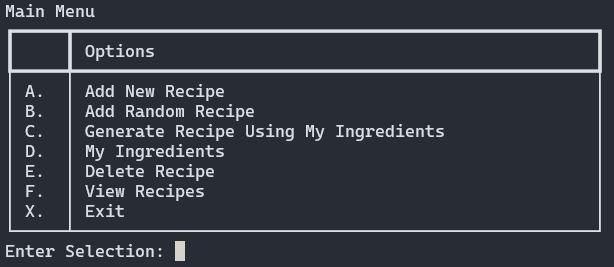
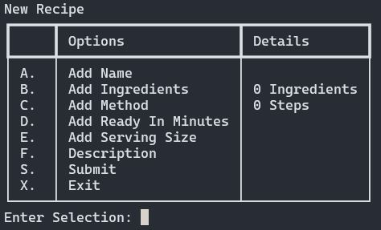

# Digital Dish created by Python

## Description

Digital Dish is like having a personal assistant for food lovers and home cooks. It’s designed in Python to be user-friendly and packed with great features that make managing, finding, and cooking amazing recipes a breeze.

#### Key Features

- <b>Create Recipe:</b> Input details recipe information including: Name, Ingredients, Methods, Ready in Minutes, Serving Size, Description.
- <b>Random Recipe Generator:</b> Explore new culinary adventures by fetching random recipes from an external API, sparking creativity in the kitchen.
- <b>Ingredients Management:</b> Add and manage ingredients to create personalised recipe collections or generate recipes based on available ingredients.
- <b>View and Delete:</b> Seamlessly view your saved recipes and easily delete any recipes no longer needed, keeping your collection organised.
- <b>User-Friendly Interface:</b> The app is designed to be really easy to use. Simple menus listed with selection options only consisting of a single letter or number.

<p align="center">

</p>

#### Source Control

- GitHub Repository - [https://github.com/jay-parkin/Terminal-App-Python](https://github.com/jay-parkin/Terminal-App-Python)
- Clone Repository - git clone https://github.com/jay-parkin/Terminal-App-Python.git

#### Features

The main menu is the primary source of the application which holds most of the features.

<p align="center">

</p>

1. <b>Recipe Creation:</b>

   - Users can input recipe details such as name, ingredients, method, time, servings and description
   - The user can edit the details of each value independently which then will save as a Recipe object and saved into a list with the other already added recipes.
   - I choice to have this feature perform using a `match case` as I find these very friendly when dealing with predetermined selections. (You will find this has been done through out the application where a menu is needed.)
     - The user is given a list of options to select from.
     - The choice made is stored as a String and passed through the match case
     - If the user doesn't select the exit options (which are s & x), a function will perform such as 'A' for `Add a name`

<p align="center">
    
</p>

<details>
    <summary>Click to expand code</summar>

    ```python
    # Loop menu until user exits
    choice = ""
    while choice not in ["s", "x"]:
        choice = recipes_sub_menu(current_recipe)

        # Add switch case to decide selection
        match choice:
            # Add a name
            case "a":
                current_recipe.set_name(input("Name: "))

            # Add ingredients
            case "b":
                current_recipe.clear_ingredients()
                current_recipe.add_ingredients(store_ingredient(True, ingredients_set))

            # Add method
            case "c":
                new_method(current_recipe)

            # Add ready_in_minutes
            case "d":
                current_recipe.set_ready_in_minutes(input("Ready In Minutes: "))

            # Add serving size
            case "e":
                current_recipe.set_serves(input("Serving Size: "))

            # Add description
            case "f":
                current_recipe.set_description(input("Description: "))

            # Submits recipe to csv
            case "s":
                # If a name exist than the recipe exist
                if current_recipe.get_name():
                    from csv_functions import write_recipes_to_csv

                    write_recipes_to_csv([current_recipe], "a")
                else:
                    # Don't exit this menu is it is unable to save
                    choice = -1
                    print("Error - Recipe name is required.")

            case "x":
                break

            case _:
                print("Error - invalid selection!")
    ```

</details>

## Getting Started

### Prerequisties

- Python 3.10.12 or [higher](https://www.python.org/downloads/)

### Installation

Follow the instructions below to install the Digital Dish application.<br>
This application is run via the terminal and requires the correct Python3 version and project folder structure.
Please copy the follow instructions(where applicable) and paste directly into your linux terminal.

<b>Unix based Systems - Linux & macOS</b>

1.  Open a Terminal
2.  Clone the GitHub repository:</br>
    SSH

    ```bash
    git clone git@github.com:jay-parkin/Terminal-App-Python.git
    ```

    HTTPS

    ```bash
    git clone https://github.com/jay-parkin/Terminal-App-Python.git
    ```

3.  Navigate to `/src` directory in the cloned repository:

    ```bash
    cd Terminal-App-Python/src
    ```

4.  Created an executable from the `run.sh` shell script:

    ```bash
    chmod +x run.sh
    ```

5.  Run the `run.sh` script to start the application
    ```bash
    ./run.sh
    ```

</br>
<b>Windows</b>

1.  Install WSL via [Windows Subsystem for Linux](https://learn.microsoft.com/en-us/windows/wsl/install)

2.  Open a WSL terminal
3.  Clone the GitHub repository (select only 1 method):</br>
    SSH

    ```bash
    git clone git@github.com:jay-parkin/Terminal-App-Python.git
    ```

    HTTPS

    ```bash
    git clone https://github.com/jay-parkin/Terminal-App-Python.git
    ```

4.  Navigate to `/src` directory in the cloned repository:

    ```bash
    cd Terminal-App-Python/src
    ```

5.  Created an executable from the `run.sh` shell script:

    ```bash
    chmod +x run.sh
    ```

6.  Run the `run.sh` script to start the application
    ```bash
    ./run.sh
    ```

## Usage

## API Reference

###### Full Attribution: _I didn't write this api, it comes from the amazing source found below_

- https://rapidapi.com/spoonacular/api/recipe-food-nutrition - Recipe - Food - Nutrition By David

#### Description

The spoonacular Recipe - Food - Nutrition API gives you to access to thousands of recipes, storebought packaged foods, and chain restaurant menu items. Our food ontology and semantic recipe search engine makes it possible to search for recipes using natural language queries, such as “gluten free brownies without sugar” or “low fat vegan cupcakes.” You can automatically calculate the nutritional information for any recipe, estimate recipe costs, visualize ingredient lists, find recipes for what’s in your fridge, find recipes based on special diets, nutritional requirements, or favorite ingredients, classify recipes into types and cuisines, convert ingredient amounts, or even compute an entire meal plan. With our powerful API, you can create many kinds of food and nutrition apps.

<p align="center">
    
</p>

Special diets/dietary requirements currently available include: vegan, vegetarian, pescetarian, gluten free, grain free, dairy free, high protein, low sodium, low carb, Paleo, Primal, ketogenic, and more.

#### Get Recipe Information

```https
  GET url = f"https://spoonacular-recipe-food-nutrition-v1.p.rapidapi.com/recipes/{id}/information"
```

| Parameter | Type     | Description                         |
| :-------- | :------- | :---------------------------------- |
| `api_key` | `string` | **Required**. Your API key          |
| `id`      | `string` | **Required**. Id of recipe to fetch |

#### Get Random Recipes

```https
  GET url = "https://spoonacular-recipe-food-nutrition-v1.p.rapidapi.com/recipes/random"
```

| Parameter | Type     | Description                |
| :-------- | :------- | :------------------------- |
| `api_key` | `string` | **Required**. Your API key |

#### Get Search Recipes by Ingredients

```https
  GET url: 'https://spoonacular-recipe-food-nutrition-v1.p.rapidapi.com/recipes/findByIngredients'
```

| Parameter | Type     | Description                                |
| :-------- | :------- | :----------------------------------------- |
| `api_key` | `string` | **Required**. Your API key                 |
| `list`    | `string` | **Required**. List of Ingredients to fetch |

<p align="center">
    
</p>

## Credits
