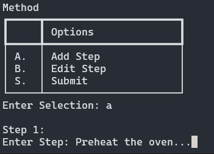
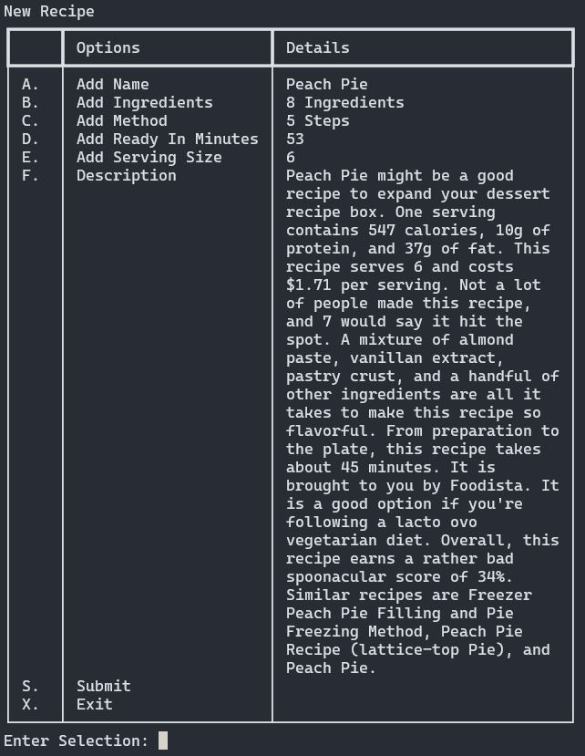

# Digital Dish created by Python

- [Description](#description)
- [Key Features](#key-features)
- [Source Control](#source-control)
- [Features](#features)
- [Getting Started](#getting-started)
  - [Prerequisties](#prerequisties)
  - [Installation](#installation)
- [Usage](#usage)
- [API Reference](#api-reference)
  - [Description](#description-1)
  - [Get Recipe Information](#get-recipe-information)
  - [Get Random Recipes](#get-random-recipes)
  - [Get Search Recipes by Ingredients](#get-search-recipes-by-ingredients)
- [Credits](#credits)

## Description

Digital Dish is like having a personal assistant for food lovers and home cooks. It’s designed in Python to be user-friendly and packed with great features that make managing, finding, and cooking amazing recipes a breeze.

### Key Features

- <b>Create Recipe:</b> Input details recipe information including: Name, Ingredients, Methods, Ready in Minutes, Serving Size, Description.
- <b>Random Recipe Generator:</b> Explore new culinary adventures by fetching random recipes from an external API, sparking creativity in the kitchen.
- <b>Ingredients Management:</b> Add and manage ingredients to create personalised recipe collections or generate recipes based on available ingredients.
- <b>View and Delete:</b> Seamlessly view your saved recipes and easily delete any recipes no longer needed, keeping your collection organised.
- <b>User-Friendly Interface:</b> The app is designed to be really easy to use. Simple menus listed with selection options only consisting of a single letter or number.

<p align="center">

</p>

### Source Control

- GitHub Repository - [https://github.com/jay-parkin/Terminal-App-Python](https://github.com/jay-parkin/Terminal-App-Python)
- Clone Repository - `git clone https://github.com/jay-parkin/Terminal-App-Python.git`

### Features

The main menu is the main feature of the application which holds most of the operations.

<p align="center">

</p>

<details>
<summary>Click to expand code</summary>

```python
# Loop menu until user exits
choice = ""
while choice != "x":
    choice = create_menu()

    # Add switch case to decide selection
    match choice:
        # Add new recipe
        case "a":
            new_recipe()

        # Add random recipe
        case "b":
            recipe = Recipes()
            #  Find the id from a random reicpe and pass it
            #  into a function to pull the rest of the info
            recipe = get_recipe_from_api(get_recipe_id(random_recipe_request()))

            write_recipes_to_csv([recipe], "a")

        # Generate recipe using my ingredients
        case "c":
            recipe_by_ingredient()

        # Store my ingredients
        case "d":
            store_ingredient(False)

        # Delete recipe
        case "e":
            view_recipes("Delete")

        # View recipes // read csv
        case "f":
            view_recipes("View")

        # Exit app
        case "x":
            print_goodbye()
            break

        case _:
            print("Error - Invalid selection!")

```

</details>
</br>

#### <b>Recipe Creation:</b>

_<b>New Recipe</b>_

- Input and refine details such as the recipe's name, ingredients, preparation steps, cooking time, servings, and a descriptive narrative.
- Each element of the user's recipe can be independently modified, ensuring the recipe is captured exactly as envisioned. Changes are saved into a structured Recipe object, which neatly collects alongside previously crafted recipes.
- I choice to have this feature perform using a `match case` as I find these very friendly when dealing with predetermined selections. (You will find this has been done through out the application where a menu is needed.)
- Choose from a list of options.
  Selections are handled efficiently through a match case structure.
- Continual interaction is encouraged, except when exiting options ('s' & 'x' are to submit or exit respectively) which trigger specific functions like `A` for adding a recipe name or `F` for the description.

<p align="center">
    
</p>

<details>
<summary>Click to expand code</summary>

```python
    # Loop menu until user exits
    choice = ""
    while choice not in ["s", "x"]:
        choice = recipes_sub_menu(current_recipe)

        # Add switch case to decide selection
        match choice:
            # Add a name
            case "a":
                current_recipe.set_name(input("Name: "))

            # Add ingredients
            case "b":
                current_recipe.clear_ingredients()
                current_recipe.add_ingredients(store_ingredient(True, ingredients_set))

            # Add method
            case "c":
                new_method(current_recipe)

            # Add ready_in_minutes
            case "d":
                current_recipe.set_ready_in_minutes(input("Ready In Minutes: "))

            # Add serving size
            case "e":
                current_recipe.set_serves(input("Serving Size: "))

            # Add description
            case "f":
                current_recipe.set_description(input("Description: "))

             # Submits recipe to csv
            case "s":
                # If a name exist than the recipe exist
                if current_recipe.get_name():
                    from csv_functions import write_recipes_to_csv

                    write_recipes_to_csv([current_recipe], "a")
                else:
                    # Don't exit this menu is it is unable to save
                    choice = -1
                    print("Error - Recipe name is required.")

            case "x":
                break

            case _:
                print("Error - invalid selection!")

```

</details>
</br>

_<b>Add Method</b>_

Moving beyond simple ingredient lists, the `Add Method` feature allows for detailed, step-by-step documentation of the recipe creation process:

- `Add Method` allows the user to insert detailed instructions into a mutable `List[]`, a perfect choice for an ordered and adaptable set of directions.

```python
# Add a new step to the method
def add_step(steps_count, current_recipe):
    next_step = f"Step {steps_count}:"
    print(f"\n{next_step}")

    method_step = input("Enter Step: ")
    current_recipe.set_method(f"{method_step}")
```

- Input() will be asked of the user to `Enter Step:` and then stored into a local `method_step` variable.

- This will then append each step into a list which is given to the Recipe object using a setter method.
- This allows the user to add as many steps to a method as they wish.

```python
def set_method(self, method):
    if method:
        self._methods.append(method)
```

- Steps are editable, enabling ongoing refinement and perfecting of the recipe.

<p align="center">
    
</p>

_<b>Submit Recipe</b>_

- Submitting the recipes stores all the information provided (the name, ingredients, method, ready in minutes, serving size and description) into a Recipe() object.
- Upon filling out the recipe `S. Submit` will become available.

<p align="center">
    
</p>

- The submission process then passes the Recipe object to a file writer, systematically storing each attribute into a CSV file

_<b>Csv Functions</b>_

- Writing recipes to csv happens behind the scenes.
- Each time an item is submitted or saved the `write_recipes_to_csv()` is called.
- This function has 2 parameters; `Recipe object` & `mode`.
- The Recipe object is stored inside the recipe.py class
- While the mode refers to the operation of the writer class. [`w`, `a` or `r+`]

<details>
<summary>Click to expand code</summary>

```python
# Store recipe into a csv with headers
def write_recipes_to_csv(recipes, mode):
    try:
        print("Saving...")
        file_exists = os.path.isfile(recipes_file)

        with open(recipes_file, mode, newline="") as file:
            writer = csv.writer(file)

            # Write header only if the file doesn't exist
            if not file_exists or mode == "w":
                writer.writerow(["Name", "Ingredients", "Ready In Minutes",
                                 "Serving Size", "Steps", "Description", "Status"])

            for current_recipe in recipes:
                if current_recipe.get_status() == "active":
                    # Join methods with a delimiter
                    # methods_str = "; ".join(current_recipe.get_methods())
                    methods_str = "; ".join([", ".join(method)
                                             if isinstance(method, list)
                                             else method for method in 
                                             current_recipe.get_methods()])

                    # Write recipe details including methods
                    writer.writerow([
                        current_recipe.get_name(),
                        current_recipe.get_ingredients_csv(),
                        current_recipe.get_ready_in_minutes(),
                        current_recipe.get_serves(),
                        methods_str,
                        current_recipe.get_description(),
                        current_recipe.get_status()
                    ])

    except IOError:
        print(f"Error writing to '{recipes_file}'")
```


</details>

## Getting Started

### Prerequisties

- Python 3.10.12 or [higher](https://www.python.org/downloads/)

### Installation

Follow the instructions below to install the Digital Dish application.<br>
This application is run via the terminal and requires the correct Python3 version and project folder structure.
Please copy the follow instructions(where applicable) and paste directly into your linux terminal.

<details>
<summary><b>Unix based Systems - Linux & macOS</b></summary>

1.  Open a Terminal
2.  Clone the GitHub repository:</br>
    via SSH

    ```bash
    git clone git@github.com:jay-parkin/Terminal-App-Python.git
    ```

    via HTTPS

    ```bash
    git clone https://github.com/jay-parkin/Terminal-App-Python.git
    ```

3.  Navigate to `/src` directory in the cloned repository:

    ```bash
    cd Terminal-App-Python/src
    ```

4.  Created an executable from the `run.sh` shell script:

    ```bash
    chmod +x run.sh
    ```

5.  Run the `run.sh` script to start the application

    ```bash
    ./run.sh
    ```

</details>
</br>

<details>
<summary><b>Windows</b></summary>

1.  Install WSL via [Windows Subsystem for Linux](https://learn.microsoft.com/en-us/windows/wsl/install)

2.  Open a WSL terminal
3.  Clone the GitHub repository (select only 1 method):</br>
    SSH

    ```bash
    git clone git@github.com:jay-parkin/Terminal-App-Python.git
    ```

    HTTPS

    ```bash
    git clone https://github.com/jay-parkin/Terminal-App-Python.git
    ```

4.  Navigate to `/src` directory in the cloned repository:

    ```bash
    cd Terminal-App-Python/src
    ```

5.  Created an executable from the `run.sh` shell script:

    ```bash
    chmod +x run.sh
    ```

6.  Run the `run.sh` script to start the application

    ```bash
    ./run.sh
    ```

</details>

## Usage

## API Reference

###### Full Attribution: _I didn't write this api, it comes from the amazing source found below_

- https://rapidapi.com/spoonacular/api/recipe-food-nutrition - Recipe - Food - Nutrition By David

#### Description

The spoonacular Recipe - Food - Nutrition API gives you to access to thousands of recipes, storebought packaged foods, and chain restaurant menu items. Our food ontology and semantic recipe search engine makes it possible to search for recipes using natural language queries, such as “gluten free brownies without sugar” or “low fat vegan cupcakes.” You can automatically calculate the nutritional information for any recipe, estimate recipe costs, visualize ingredient lists, find recipes for what’s in your fridge, find recipes based on special diets, nutritional requirements, or favorite ingredients, classify recipes into types and cuisines, convert ingredient amounts, or even compute an entire meal plan. With our powerful API, you can create many kinds of food and nutrition apps.

<p align="center">
    
</p>

Special diets/dietary requirements currently available include: vegan, vegetarian, pescetarian, gluten free, grain free, dairy free, high protein, low sodium, low carb, Paleo, Primal, ketogenic, and more.

#### Get Recipe Information

```https
  GET url = f"https://spoonacular-recipe-food-nutrition-v1.p.rapidapi.com/recipes/{id}/information"
```

| Parameter | Type     | Description                         |
| :-------- | :------- | :---------------------------------- |
| `api_key` | `string` | **Required**. Your API key          |
| `id`      | `string` | **Required**. Id of recipe to fetch |

#### Get Random Recipes

```https
  GET url = "https://spoonacular-recipe-food-nutrition-v1.p.rapidapi.com/recipes/random"
```

| Parameter | Type     | Description                |
| :-------- | :------- | :------------------------- |
| `api_key` | `string` | **Required**. Your API key |

#### Get Search Recipes by Ingredients

```https
  GET url: 'https://spoonacular-recipe-food-nutrition-v1.p.rapidapi.com/recipes/findByIngredients'
```

| Parameter | Type     | Description                                |
| :-------- | :------- | :----------------------------------------- |
| `api_key` | `string` | **Required**. Your API key                 |
| `list`    | `string` | **Required**. List of Ingredients to fetch |

<p align="center">
    
</p>

## Credits
